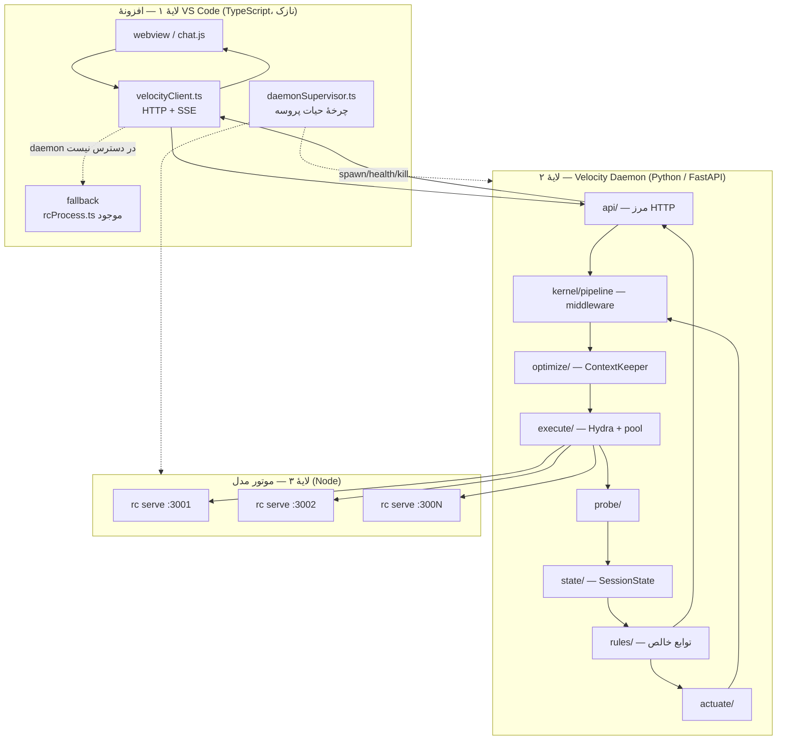

# RC Velocity — معماری و ساختار کد

انتقال قابلیت `goodcoder` (Velocity Suite) به `rc-vscode`، با backend پایتون.

**نسخهٔ سند: v0.2** — طراحی، بدون پیاده‌سازی.

> تغییرات نسبت به v0.1: سطح API واقعی `rc serve` بررسی و لحاظ شد (بخش ۲)؛ پنج نتیجه‌گیری قبلی اصلاح شد (بخش ۳)؛ معماری به سه‌لایه با daemon پایتون تبدیل شد (بخش ۴ به بعد).

---

## 0. خلاصهٔ اجرایی

`goodcoder` یک **مشخصات فنی** است، نه محصول: `ARCHITECTURE.md` کامل است ولی همهٔ `packages/*/index.js` استاب‌اند (`// TODO: implement`). پس آنچه منتقل می‌شود ستون فقرات معماری است، نه کد.

ستون فقرات goodcoder: **Probe → Core → Rules → Surface/Actuator**، با سه ماژول PitCrew / CacheKeeper / Hydra.

در v0.1 نتیجه گرفتم که daemon و API محلی goodcoder در rc-vscode سربار اضافه است و همه‌چیز باید درون‌پروسه‌ای در TypeScript باشد. **آن نتیجه‌گیری با شرط «backend پایتون» باطل می‌شود.** افزونهٔ VS Code (TypeScript) نمی‌تواند کد پایتون را مستقیم فراخوانی کند؛ پس مرز اجباراً یک API می‌شود — دقیقاً همان چیزی که goodcoder طراحی کرده بود.

معماری نهایی سه لایه است:

```
VS Code Extension (TS، نازک)  ──HTTP──▶  Velocity Daemon (Python)  ──HTTP──▶  rc serve (Node)
        کلاینت + UI                    مغز: probe/state/rules/optimize/hydra      موتور مدل
```

---

## 1. معماری goodcoder

```
velocity-suite/
├── packages/
│   ├── daemon/            # probe fusion, state, rules, actuator, local API
│   │   ├── probe/         # hooks-http | transcript-tail | otlp-receiver
│   │   ├── state/         # SessionState + TurnRecord + SQLite
│   │   ├── rules/         # هر detector یک فایل، توابع خالص
│   │   └── actuate/       # چهار کانال نوشتن برگشتی
│   ├── overlay/           # Electron: tray + overlay شفاف (HUD)
│   ├── cachekeeper/       # idle timer, mutation guard, compaction accounting
│   └── hydra/             # decompose → worktree → dispatch → diff review
├── install/               # ثبت hookها، تنظیم OTel، حذف کامل
└── docs/
```

### 1.1 چهار لایهٔ منطقی

| لایه | مسئولیت | ورودی | خروجی |
|---|---|---|---|
| **Probe** | جمع‌آوری سیگنال خام از سه منبع مستقل | hooks / JSONL / OTLP | رویداد نرمال‌شده |
| **Core** | مدل زندهٔ نشست | رویداد | `SessionState` |
| **Rules** | تشخیص، توابع خالص | `SessionState` | `{fired, severity, evidence, remedy}` |
| **Surface / Actuator** | نمایش و مداخله | Finding | HUD / تزریق context / رد ابزار |

### 1.2 سطح API در خود goodcoder

این نکته در v0.1 کم‌رنگ دیده شده بود. goodcoder **ذاتاً API-محور است**:

| نقطه | نشانی | نقش |
|---|---|---|
| گیرندهٔ hook | `POST http://127.0.0.1:8787/hook` | تمام hookها با `{"type":"http"}` و `async:true` روی loopback |
| گیرندهٔ OTLP | `:4317` (gRPC) | متریک و رویداد توکن/هزینه/زمان |
| API محلی دیمن | `daemon/ … local API` | مصرف‌کننده‌ها: overlay، cachekeeper، hydra |

یعنی داخل goodcoder هم دیمن و سطح نمایش با HTTP حرف می‌زنند، نه با فراخوانی مستقیم. **این دقیقاً الگویی است که با backend پایتون به آن نیاز داریم.**

### 1.3 اصول طراحی

1. **Read-only by default** — دیمن فقط ناظر است مگر با کلیک صریح.
2. **Diagnose before prescribing** — `evidence` اجباری است.
3. **Local-first** — هیچ خروج شبکه‌ای؛ transcript حاوی سورس‌کد است.
4. **Degrade, don't fail** — نبود OTel ← transcript؛ نبود transcript ← فقط hooks.
5. **Zero added latency** — دیمن هرگز در مسیر بحرانی نوبت نیست.

---

## 2. سطح API واقعی که در دسترس داریم

این بخش در v0.1 وجود نداشت و مهم‌ترین بازنگری است. `vendor/rp-cli/dist/source/server/` بررسی شد.

### 2.1 نقاط انتهایی `rc serve`

```
GET  /health                              → { status, object, timestamp }
GET  /v1/models
GET  /v1/models/:model
POST /v1/chat/completions
POST /v1/chat/completions/:sessionId      ← ادامهٔ نشست
```

راه‌اندازی: `rc serve --port 3000 --host 127.0.0.1`
احراز هویت: `DEEPSEEK_TOKEN` / `RC_TOKEN` در env، یا هدر `Authorization: Bearer <token>`

### 2.2 آنچه این API می‌دهد و در v0.1 نادیده گرفته بودم

| قابلیت | شواهد در کد | چرا مهم است |
|---|---|---|
| **تداوم نشست** | `POST /v1/chat/completions/:sessionId`؛ `chatSessionExists` و `setCurrentSessionId` در `server/session.js`؛ هدر پاسخ `X-RP-Session-Id` | لازم نیست تاریخچه دوباره فرستاده شود |
| **شمارش واقعی توکن** | `toUsage()` در `server/request.js` ← `{prompt_tokens, completion_tokens, total_tokens}`؛ و `stream_options.include_usage` | گیج `Fuel` در goodcoder عیناً قابل پیاده‌سازی می‌شود |
| **استریم SSE** | `stream: true`؛ `streamChunk`/`writeSse` در `server/stream.js` | اولین توکن بلافاصله دیده می‌شود |
| **استریم جدای تفکر** | دلتاهای `reasoning_content` | نمایش زندهٔ زنجیرهٔ تفکر |
| **لغو تمیز** | `res.on('close')` ← `clientDisconnected` ← `stopCurrentGeneration` | دیگر نیازی به `taskkill /T /F` نیست |
| **فراخوانی ابزار** | `parseClientToolCalls`، `validateTools`، `rememberSessionTools` | ابزارها می‌توانند سمت کلاینت تعریف شوند |

### 2.3 و یک قید سخت که طراحی v0.1 را می‌شکند

```js
// server/session.js
let completionQueue = Promise.resolve();
export function enqueueCompletion(task) {
    const run = completionQueue.then(task, task);
    completionQueue = run.then(() => undefined, () => undefined);
    return run;
}
```

**تمام completionها در یک صف سراسری سریال می‌شوند.** پس:

> **یک نمونهٔ `rc serve` هرگز موازی‌سازی نمی‌کند.** Hydra در حالت Race یا Split از یک سرور عبور نمی‌کند — صف می‌شود و هیچ سودی ندارد.

راه‌حل در بخش ۴.۴: استخر N نمونهٔ سرور روی N پورت، یا بازگشت به N پروسهٔ `--plain`. این تصمیم باید در طراحی صریح باشد وگرنه Hydra بی‌صدا بی‌اثر می‌شود.

---

## 3. اهرم‌های سرعت — بازنگری‌شده

| # | یافتهٔ v0.1 | وضعیت پس از دیدن API |
|---|---|---|
| **F1** | round-trip اضافه برای system prompt در `plainPrompt.js` | **در حالت serve خودبه‌خود حل می‌شود.** `runCompletion` همان کار را می‌کند ولی با گارد `initializedSessionToken !== token`، یعنی **یک‌بار به‌ازای هر توکن** نه هر نوبت |
| **F2** | تاریخچه فشرده شود | **اصلاح شد — راه‌حل بهتر:** با `:sessionId` اصلاً تاریخچه فرستاده نمی‌شود. فشرده‌سازی از «راه‌حل اصلی» به «پشتیبان حالت spawn» تنزل می‌کند |
| **F3** | `@mention` بدون کران | بدون تغییر، معتبر |
| **F4** | سربار spawn سرد | بدون تغییر، معتبر — و حالا مسیر serve منافع بسیار بیشتری هم دارد |
| **F5** | Pair سریال است | معتبر، **ولی مشروط** به رفع قید صف بخش ۲.۳ |
| **F6** | — | **جدید و احتمالاً بزرگ‌ترین برد:** امروز `rcProcess.ts` کل stdout را بافر می‌کند و تا خروج پروسه هیچ‌چیز نشان نمی‌دهد. با SSE، تأخیر *ادراکی* از «کل مدت نوبت» به «زمان اولین توکن» سقوط می‌کند |
| **F7** | — | **جدید:** لغو از راه بستن اتصال HTTP، به‌جای `killChildProcess` و `taskkill /T /F` در `rcProcess.ts` |

---

## 4. معماری پیشنهادی: سه لایه با backend پایتون

### 4.1 چرا سه لایه

افزونهٔ VS Code باید TypeScript باشد (قید سکو). backend باید پایتون باشد (قید تو). این دو فقط از راه یک پروتکل به هم می‌رسند. پس مرز، اجباری است — و بهترین کار این است که آن را یک مرز **تمیز و نسخه‌دار** کنیم، نه یک لولهٔ موقتی.

سود جانبی: همان مرز، شکاف بخش ۴.۶ را هم می‌بندد.



### 4.2 قرارداد سیم — مرز واقعی

پروتکل مرز **superset سازگار با `rc serve`** است. یعنی daemon پایتون از بیرون شبیه همان API به‌نظر می‌رسد، به‌علاوهٔ چند مسیر تشخیصی. نتیجه: اگر daemon نبود، کلاینت می‌تواند مستقیم به `rc serve` وصل شود و همه‌چیز کار کند (اصل *Degrade, don't fail*).

```
# سازگار با rc serve — مسیر اصلی
POST /v1/chat/completions              (stream + غیر stream)
POST /v1/chat/completions/:sessionId
GET  /health

# افزودهٔ Velocity
GET  /velocity/state/:sessionId        → SessionState فعلی
GET  /velocity/findings/:sessionId     → Finding[] با evidence
GET  /velocity/modules                 → کشف: id، نسخه، سلامت، فعال؟
POST /velocity/modules/:id/disable
POST /velocity/hydra/run               → race | split
GET  /velocity/hydra/:runId/events     → SSE پیشرفت هر کاندید
GET  /velocity/doctor                  → تشخیص خودِ سیستم
```

قراردادها با pydantic تعریف می‌شوند و **همان مدل‌ها** به JSON Schema صادر و از روی آن تایپ‌های TS تولید می‌شوند. یک منبع حقیقت، دو زبان.

```
contracts/ (pydantic)  ──export──▶  openapi.json  ──codegen──▶  src/velocity/generated/types.ts
```

### 4.3 ساختار کد پایتون

```
velocity-daemon/
├── pyproject.toml               # نسخه‌بندی مستقل + تعریف entry-pointها
│
├── velocity/
│   ├── contracts/               # ❶ لایهٔ قرارداد — بدون وابستگی به FastAPI یا httpx
│   │   ├── ports.py             # typing.Protocol — Probe, Detector, Optimizer,
│   │   │                        #   Executor, Strategy, Actuator, Store, Clock
│   │   ├── models.py            # pydantic: RunRequest, RunResult, Finding, Usage
│   │   ├── state.py             # SessionState, TurnRecord — frozen dataclass
│   │   ├── events.py            # VelocityEvent (اتحاد تفکیک‌شده)
│   │   └── manifest.py          # ModuleManifest {id, version, api_range, kind}
│   │
│   ├── kernel/                  # ❷ ریشهٔ ترکیب — فقط contracts را می‌شناسد
│   │   ├── container.py         # DI صریح، بدون singleton سراسری
│   │   ├── registry.py          # کشف از راه entry_points + سنجش api_range
│   │   ├── bus.py               # pub/sub غیرهمگام، fan-out ایزوله
│   │   ├── pipeline.py          # compose(*middleware) — async
│   │   ├── faults.py            # safe_call + CircuitBreaker
│   │   └── aspects.py           # @timed @traced @breaker  ← AOP
│   │
│   ├── api/                     # ❸ تنها لایه‌ای که FastAPI را می‌شناسد
│   │   ├── app.py               # ساخت اپ، mount کردن routerها
│   │   ├── completions.py       # مسیرهای سازگار با rc serve
│   │   ├── velocity_routes.py   # مسیرهای /velocity/*
│   │   └── sse.py               # آداپتور استریم
│   │
│   ├── probe/                   # ❹ فقط مشاهده
│   │   ├── http_probe.py        # زمان‌بندی، کد وضعیت، usage از پاسخ
│   │   ├── stream_probe.py      # زمان تا اولین توکن، نرخ توکن
│   │   └── usage_probe.py       # prompt_tokens ← گیج Fuel
│   │
│   ├── state/
│   │   ├── session_store.py     # reducer خالص روی رویداد
│   │   └── persist/
│   │       ├── memory.py        # پیش‌فرض تست
│   │       └── sqlite.py        # پایدارسازی (sqlite3 کتابخانهٔ استاندارد)
│   │
│   ├── rules/                   # ❺ تشخیص — توابع خالص، بدون I/O
│   │   ├── context_bloat.py     # prompt_tokens / سقف مدل
│   │   ├── wander.py
│   │   ├── retry_loop.py
│   │   ├── serial_storm.py      # ← پیشنهاد Hydra
│   │   ├── slow_turn.py         # میانهٔ متحرک زمان تا اولین توکن
│   │   └── effort_mismatch.py
│   │
│   ├── optimize/                # ❻ ContextKeeper
│   │   ├── session_reuse.py     # F2 — استفاده از :sessionId به‌جای ارسال تاریخچه
│   │   ├── history_compactor.py # پشتیبان برای حالت spawn
│   │   ├── mention_bounder.py   # F3
│   │   └── effort_autotune.py
│   │
│   ├── execute/                 # ❼ Hydra — تنها لایهٔ مجاز به I/O شبکه
│   │   ├── server_pool.py       # ⚠ حل قید صف بخش ۲.۳
│   │   ├── serve_executor.py    # F4، F6، F7
│   │   ├── spawn_executor.py    # پشتیبان: `rc --plain`
│   │   ├── race_strategy.py     # F5
│   │   ├── split_strategy.py
│   │   ├── scheduler.py         # سقف هم‌زمانی، بودجه، لغو
│   │   └── judge.py
│   │
│   └── actuate/
│       ├── prompt_advisor.py
│       └── notice.py
│
└── tests/
    ├── contract/                # یک مجموعه تست مشترک به‌ازای هر Protocol
    ├── rules/                   # fixture ثابت ← بدون شبکه
    └── golden/                  # replay لاگ رویداد
```

### 4.4 استخر سرور — حل قید صف

مهم‌ترین جزئیات پیاده‌سازی. بدون این، Hydra بی‌اثر است.

```python
# execute/server_pool.py
class ServerPool:
    """N نمونهٔ `rc serve` روی N پورت loopback.

    چون server/session.py یک صف سراسری per-process دارد،
    موازی‌سازی فقط با چند پروسه ممکن است، نه چند اتصال.
    """
    async def acquire(self) -> ServerLease: ...   # اجاره‌دادن یک نمونهٔ آزاد
    async def health(self) -> list[Health]: ...   # GET /health روی هرکدام
    async def scale_to(self, n: int) -> None: ... # بالا/پایین بردن تعداد
```

قواعد:
- اندازهٔ پیش‌فرض ۱ (رفتار امروز، بدون مصرف حافظهٔ اضافه)؛ فقط هنگام درخواست Hydra بزرگ می‌شود.
- هر نمونه پورت خودش را دارد، از `0` می‌گیرد و پورت واقعی را از سیستم‌عامل می‌خواند (بدون رقابت پورت).
- مالکیت پروسه در daemon است؛ در خاموشی، `SIGTERM` به همه.
- سقف = `min(concurrency_setting, cpu_count)`.

### 4.5 لایهٔ TypeScript پس از این تغییر

تقریباً هرچه در v0.1 برای TS طراحی کرده بودم به پایتون منتقل می‌شود. آنچه در TS می‌ماند نازک است:

```
src/velocity/
├── index.ts                 # createVelocity() — همان یک درز اتصال
├── client.ts                # HTTP + SSE به daemon
├── supervisor.ts            # spawn/health/backoff/kill دیمن پایتون
├── settings.ts              # rc.velocity.*
├── surface/
│   ├── hudPresenter.ts      # ViewModel خالص
│   └── webviewSurface.ts    # postMessage
└── generated/types.ts       # تولیدشده از openapi.json — دست‌نویس نیست
```

قرارداد `createVelocity` بدون تغییر می‌ماند:

- `enabled === false` ← دقیقاً `runPlainPrompt` موجود برگردانده می‌شود. صفر هزینه، صفر تغییر رفتار.
- daemon بالا نیامد یا `/health` رد داد ← بازگشت به `runPlainPrompt` با یک اعلان غیرمسدودکننده.
- **نوبت کاربر هرگز به‌خاطر Velocity شکست نمی‌خورد.**

### 4.6 شکافی که این معماری می‌بندد

در v0.1 گفتم rc-vscode ناظر بیگانه ندارد. **درست نبود.** `terminalRunner.ts::runRcInteractive()` یک ترمینال VS Code می‌سازد و `rc` را در آن اجرا می‌کند — پروسه‌ای کاملاً بیرون از دید افزونه. طراحی درون‌پروسه‌ای v0.1 آن نشست را اصلاً نمی‌دید.

با daemon دارای API، هر کلاینتی می‌تواند رویداد بفرستد: افزونه، یک wrapper دور `rc` تعاملی، یا CI. این همان دلیلی است که goodcoder از اول hookها را روی HTTP گذاشته بود.

---

## 5. تطبیق با پانزده ویژگی — با اصطلاحات پایتون

| # | ویژگی | تحقق در پایتون |
|---|---|---|
| 1 | **Loose Coupling** | `typing.Protocol` = تطبیق ساختاری. هیچ ماژولی از ماژول دیگر ارث نمی‌برد یا ایمپورت نمی‌کند؛ همه فقط `contracts/` را می‌بینند. مرز TS↔Python هم HTTP است، نه FFI |
| 2 | **High Cohesion** | هر بسته یک دلیل تغییر. `rules/` فقط با تغییر تشخیص، `execute/` فقط با تغییر نحوهٔ اجرا |
| 3 | **Encapsulation** | هر ماژول یک factory برمی‌گرداند؛ حالت در نمونه، نه در متغیر سطح‌ماژول. (نقض امروز: `let currentSession` در `rcProcess.ts` و `let pairRunning` در `pairMode.ts` و `completionQueue` سراسری در `server/session.js`) |
| 4 | **Well-defined Interfaces** | `contracts/` نه FastAPI ایمپورت می‌کند نه httpx نه sqlite. pydantic اعتبارسنجی را در مرز رایگان می‌دهد و OpenAPI را هم تولید می‌کند |
| 5 | **Reusability** | چون contracts وابستگی چارچوبی ندارد، `rules/` و `optimize/` در notebook، CLI، یا CI بدون تغییر اجرا می‌شوند. سرویس‌دهی به VS Code فقط یکی از مصرف‌کننده‌هاست |
| 6 | **Replaceability** | هر پورت حداقل دو پیاده‌سازی: `Store` (memory/sqlite)، `Executor` (serve/spawn)، `Strategy` (single/race/split)، `Clock` (real/fake). تعویض = یک خط در `container.py` |
| 7 | **Independent Dev & Testing** | detectorها `(SessionState) -> Finding \| None`. pytest با fixture ثابت، بدون شبکه، بدون Node، بدون VS Code. یک contract-test مشترک برای هر Protocol که تمام پیاده‌سازی‌ها باید از آن رد شوند |
| 8 | **Composability** | `compose(*middleware)` روی callableهای async؛ detectorها فهرست‌اند؛ استراتژی‌ها تودرتو (Race از Splitها). ترتیب زنجیره **پیکربندی** است نه کد |
| 9 | **Maintainability & Extensibility** | افزودن detector = یک فایل به‌علاوهٔ یک سطر در `pyproject.toml`. **هیچ فایل موجودی ویرایش نمی‌شود** |
| 10 | **Single Responsibility** | هر ماژول یک کار. (نقض امروز: `chatCommon.ts` چهار کار می‌کند — تولید HTML، مسیریابی پیام، ارکستراسیون pair، مدیریت خطای توکن) |
| + | **Stateless** | rules و optimizers توابع خالص روی `frozen dataclass`؛ حالت به‌عنوان آرگومان پاس داده می‌شود. نتیجه: **replay** — لاگ رویداد را دوباره بده، همان تشخیص‌ها بیرون می‌آید (پوشهٔ `tests/golden/`) |
| + | **Aspect-Oriented** | دکوراتور، اصطلاح بومی پایتون: `@timed` `@traced` `@breaker` در `kernel/aspects.py`. هیچ detectorی `try/except` یا logger ندارد |
| + | **Fault Isolation** | `safe_call` دور هر فراخوانی افزونه؛ CircuitBreaker پس از N شکست ماژول را غیرفعال و در `/velocity/modules` گزارش می‌کند. مرز پروسه‌ای هم هست: سقوط daemon پایتون فقط باعث بازگشت به مسیر قدیمی می‌شود |
| + | **Independent Versioning** | هر بستهٔ افزونه‌ای `pyproject.toml` خودش را با `version` و `requires-dist` دارد؛ registry ماژول ناسازگار با `api_range` را بارگذاری نمی‌کند. daemon و افزونه هم مستقل نسخه می‌خورند و در `/health` نسخهٔ قرارداد را رد و بدل می‌کنند |
| + | **Discoverability** | `importlib.metadata.entry_points(group="rc_velocity.detectors")` — کشف واقعی افزونه در زمان نصب، بدون هیچ فهرست دستی. `GET /velocity/modules` همان را برای UI بیرون می‌دهد و `/velocity/doctor` سلامت را |

```toml
# نمونهٔ کشف‌پذیری در pyproject.toml — ثبت بدون ویرایش هیچ کد موجود
[project.entry-points."rc_velocity.detectors"]
context_bloat = "velocity.rules.context_bloat:build"
wander        = "velocity.rules.wander:build"

[project.entry-points."rc_velocity.optimizers"]
session_reuse = "velocity.optimize.session_reuse:build"
```

---

## 6. بسته‌بندی و توزیع — مسئلهٔ واقعی

این تنها هزینهٔ جدی شرط «backend پایتون» است و باید صریح گفته شود.

VSIX فعلی **۱۷۰ مگابایت** است، چون در نسخهٔ 0.1.3 عمداً Node را bundle کردی تا کاربر لازم نباشد چیزی نصب کند (`vendor/node/<platform>-<arch>/`). حالا یک زمان اجرای دوم هم لازم است.

| گزینه | حجم افزوده | ریسک |
|---|---|---|
| نیاز به Python سیستمی ۳٫۱۱+ | ۰ | **وعدهٔ «بدون نصب» را می‌شکند** — همان چیزی که برایش کار کردی |
| bundle کردن python-build-standalone | حدود ۴۵ تا ۶۰ مگ به‌ازای هر سکو | حجم؛ ولی با الگوی موجود `vendor/` سازگار است |
| **باینری تک‌فایلی (PyInstaller / Nuitka)** | حدود ۱۵ تا ۲۵ مگ، فقط سکوی جاری | نیاز به build در CI به‌ازای هر سکو |

**پیشنهاد: گزینهٔ سوم.** فقط باینری سکوی هدف در VSIX می‌رود، `scripts/bundle-python.mjs` قرینهٔ `bundle-node.mjs` می‌شود، و `supervisor.ts` دقیقاً همان الگوی `resolveNodePath()` را دنبال می‌کند: اول باینری bundle‌شده، بعد پایتون سیستمی، بعد اعلام شکست و بازگشت به مسیر قدیمی.

---

## 7. مسیر اجرا

| گام | محتوا | معیار موفقیت |
|---|---|---|
| **P0** | `contracts/` + `kernel/` + `api/` با یک عبوردهندهٔ محض به `rc serve`. بدون قاعده، بدون بهینه‌سازی | با `enabled=false` رفتار بایت‌به‌بایت مثل امروز؛ با `enabled=true` پاسخ‌ها یکسان‌اند و فقط از daemon رد می‌شوند |
| **P1** | `serve_executor` با SSE، به‌علاوهٔ استریم در webview (F6, F7, F4) | نمایش اولین توکن به‌جای انتظار تا پایان پروسه — بزرگ‌ترین برد ادراکی |
| **P2** | `session_reuse` روی `:sessionId` (F2) | `prompt_tokens` نوبت بیستم دیگر بزرگ‌تر از نوبت دوم نیست |
| **P3** | `mention_bounder` (F3) + `probe` + `state` + `sqlite` | جدول زمان‌بندی و مصرف توکن واقعی هر نوبت |
| **P4** | `rules/` + HUD خواندنی + `/velocity/doctor` | در نشستی که کند حس شد، HUD دلیل را با evidence نام می‌برد و انسان تأیید می‌کند |
| **P5** | `server_pool` + `race_strategy` جایگزین Pair سریال (F5) | همان کیفیت با ۲ انتظار سریال به‌جای ۶ — **فقط پس از تأیید اینکه استخر واقعاً موازی می‌شود** |

P1 و P2 بردهای قطعی‌اند و به هیچ تشخیصی نیاز ندارند. P4 به بعد ارزش افزوده است.

---

## 8. ریسک‌ها

| ریسک | شدت | مهار |
|---|---|---|
| صف سراسری `enqueueCompletion` باعث شود Hydra بی‌صدا بی‌اثر باشد | **بحرانی** | پیش از P5 یک بنچ اثبات موازی‌سازی روی `server_pool`؛ اگر موازی نشد، Hydra را با `spawn_executor` بساز نه serve |
| زمان اجرای دوم، حجم VSIX را بدتر کند | بالا | باینری تک‌سکویی (بخش ۶)؛ سنجش حجم در CI با آستانهٔ شکست |
| پروسهٔ یتیم daemon یا سرور پس از crash افزونه | بالا | مالکیت در `deactivate()`؛ فایل PID؛ heartbeat و خودکشی daemon پس از N ثانیه بی‌کلاینتی |
| `session_reuse` نشست را بین دو گفت‌وگوی مختلف نشت دهد | بالا | کلید نشست به‌ازای thread افزونه؛ `chatSessionExists` پیش از استفادهٔ مجدد؛ پاک‌سازی در «New chat» |
| رانش قرارداد بین daemon پایتون و افزونهٔ TS | متوسط | تولید تایپ از OpenAPI در build؛ تبادل `api_range` در `/health`؛ عدم تطابق ← بازگشت به مسیر قدیمی نه crash |
| detectorهای پرخطا و بی‌اعتمادی کاربر | متوسط | `evidence` اجباری، کتم یک‌کلیکی، سنجش نرخ کتم‌شدن |
| افت امنیتی از پورت loopback | متوسط | فقط `127.0.0.1`، پورت تصادفی، توکن نشستی در هدر، و CORS `*` سرور بالادست هرگز بیرون از loopback نرود |
| رانش overlay با به‌روزرسانی upstream `rp-cli` | متوسط | همان الگوی `scripts/apply-cli-overlay.mjs`: تشخیص عدم تطابق و رد patch با هشدار |
